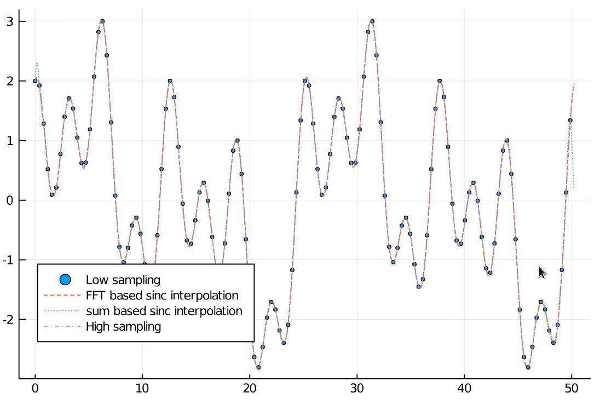

# FFTInterpolations.jl

| **Documentation**                       | **Build Status**                          | **Code Coverage**               |
|:---------------------------------------:|:-----------------------------------------:|:-------------------------------:|
| [![][docs-stable-img]][docs-stable-url] [![][docs-dev-img]][docs-dev-url] | [![][CI-img]][CI-url] | [![][codecov-img]][codecov-url] |


This package provides a simple sinc interpolation (up and downsampling) written in Julia.
It works with real and complex N-dimensional arrays.
The FFTW based method `sinc_interpolate` requires a periodic, bandwidth limited (and properly Nyquist sampled) signal.

## Installation
`FFTInterpolations.jl` is available for all version equal or above Julia 1.3. It is mainly tested under Linux but should also work on Windows.
It can be installed with the following command

```julia
julia> ] add https://github.com/roflmaostc/FFTInterpolations.jl
```

## Functionality
This package currently works only with equidistant spaced signals. We offer two main methods: `sinc_interpolate` and `downsample`.
The first one upsamples a signal by zero padding in Fourier space.
The second one downsamples a signal by cropping frequencies around the center spot. We therefore reduce resolution without aliasing. 


## Example
Below you can find a simple example for `sinc_interpolate` and `sinc_interpolate_sum`.
Furthermore, there is an image interpolation Pluto.jl notebook in the [examples folder](examples/).

```julia
 begin
	N_low = 128
	x_min = 0.0
	x_max = 16π
	
	xs_low = range(x_min, x_max, length=N_low+1)[1:N_low]
	xs_high = range(x_min, x_max, length=5000)[1:end-1]
	f(x) = sin(0.5*x) + cos(x) + cos(2 * x) + sin(0.25*x)
	arr_low = f.(xs_low)
	arr_high = f.(xs_high)
end

begin
	N = 1000
	xs_interp = range(x_min, x_max, length=N+1)[1:N]
	arr_interp = sinc_interpolate(arr_low, N)

	N2 = 1000
	xs_interp_s = range(x_min, x_max, length=N2+1)[1:N2]
	arr_interp_s = FFTInterpolations.sinc_interpolate_sum(arr_low, N2)
end

begin
	scatter(xs_low, arr_low, legend=:bottomleft, markersize=2, label="Low sampling")
	plot!(xs_interp, arr_interp, label="FFT based sinc interpolation", linestyle=:dash)
	plot!(xs_interp_s, arr_interp_s, label="sum based sinc interpolation", linestyle=:dot)
	plot!(xs_high, arr_high, linestyle=:dashdotdot, label="High sampling")
end
```



[docs-dev-img]: https://img.shields.io/badge/docs-dev-pink.svg 
[docs-dev-url]: https://roflmaostc.github.io/FFTInterpolations.jl/dev/ 

[docs-stable-img]: https://img.shields.io/badge/docs-stable-darkgreen.svg 
[docs-stable-url]: https://roflmaostc.github.io/FFTInterpolations.jl/stable/

[CI-img]: https://github.com/roflmaostc/FFTInterpolations.jl/workflows/CI/badge.svg
[CI-url]: https://github.com/roflmaostc/FFTInterpolations.jl/actions?query=workflow%3ACI 

[codecov-img]: https://codecov.io/gh/roflmaostc/FFTInterpolations.jl/branch/main/graph/badge.svg
[codecov-url]: https://codecov.io/gh/roflmaostc/FFTInterpolations.jl
